# 开源的宋俊潇项目链接
```
他这个神经网络模型的函数焦，PolicyValueNet策略价值网路模型
gitcode免VPN
https://gitcode.com/gh_mirrors/al/AlphaZero_Gomoku
GitHub
https://github.com/junxiaosong/AlphaZero_Gomoku
知乎中文说明
https://zhuanlan.zhihu.com/p/32089487

该策略价值网络主要由以下几个部分组成：
输入层：接收当前棋盘状态，形状为 (4, board_width, board_height)。
公共卷积层：由三个卷积层组成，用于提取棋盘特征。
第一个卷积层：32 个卷积核，核大小为 3x3，填充为 1，激活函数为 ReLU。
第二个卷积层：64 个卷积核，核大小为 3x3，填充为 1，激活函数为 ReLU。
第三个卷积层：128 个卷积核，核大小为 3x3，填充为 1，激活函数为 ReLU。
动作策略层：
卷积层：4 个卷积核，核大小为 1x1，激活函数为 ReLU。
全连接层：输出大小为 board_width * board_height，激活函数为 softmax，用于输出每个动作的概率。
状态价值层：
卷积层：2 个卷积核，核大小为 1x1，激活函数为 ReLU。
全连接层：输出大小为 64，激活函数为 ReLU。
全连接层：输出大小为 1，激活函数为 tanh，用于输出当前状态的价值。
```



```mermaid
graph LR
    classDef startend fill:#F5EBFF,stroke:#BE8FED,stroke-width:2px
    classDef process fill:#E5F6FF,stroke:#73A6FF,stroke-width:2px
    classDef decision fill:#FFF6CC,stroke:#FFBC52,stroke-width:2px
    
    A([输入层]):::startend -->|4通道| B(卷积层1):::process
    B -->|32通道| C(卷积层2):::process
    C -->|64通道| D(卷积层3):::process
    
    D -->|128通道| E(动作策略卷积层):::process
    E -->|4通道| F(动作策略全连接层):::process
    F -->|board_width * board_height| G(动作概率输出):::startend
    
    D -->|128通道| H(状态价值卷积层):::process
    H -->|2通道| I(状态价值全连接层1):::process
    I -->|64单元| J(状态价值全连接层2):::process
    J -->|1单元| K(状态得分输出):::startend
    
    style A fill:#F5EBFF,stroke:#BE8FED,stroke-width:2px
    style B fill:#E5F6FF,stroke:#73A6FF,stroke-width:2px
    style C fill:#E5F6FF,stroke:#73A6FF,stroke-width:2px
    style D fill:#E5F6FF,stroke:#73A6FF,stroke-width:2px
    style E fill:#E5F6FF,stroke:#73A6FF,stroke-width:2px
    style F fill:#E5F6FF,stroke:#73A6FF,stroke-width:2px
    style G fill:#F5EBFF,stroke:#BE8FED,stroke-width:2px
    style H fill:#E5F6FF,stroke:#73A6FF,stroke-width:2px
    style I fill:#E5F6FF,stroke:#73A6FF,stroke-width:2px
    style J fill:#E5F6FF,stroke:#73A6FF,stroke-width:2px
    style K fill:#F5EBFF,stroke:#BE8FED,stroke-width:2px
```

## AlphaZero-Gomoku
This is an implementation of the AlphaZero algorithm for playing the simple board game Gomoku (also called Gobang or Five in a Row) from pure self-play training. The game Gomoku is much simpler than Go or chess, so that we can focus on the training scheme of AlphaZero and obtain a pretty good AI model on a single PC in a few hours. 

References:  
1. AlphaZero: Mastering Chess and Shogi by Self-Play with a General Reinforcement Learning Algorithm
2. AlphaGo Zero: Mastering the game of Go without human knowledge

### Update 2018.2.24: supports training with TensorFlow!
### Update 2018.1.17: supports training with PyTorch!

### Example Games Between Trained Models
- Each move with 400 MCTS playouts:  


### Requirements
To play with the trained AI models, only need:
- Python >= 2.7
- Numpy >= 1.11

To train the AI model from scratch, further need, either:
- Theano >= 0.7 and Lasagne >= 0.1      
or
- PyTorch >= 0.2.0    
or
- TensorFlow

**PS**: if your Theano's version > 0.7, please follow this [issue](https://github.com/aigamedev/scikit-neuralnetwork/issues/235) to install Lasagne,  
otherwise, force pip to downgrade Theano to 0.7 ``pip install --upgrade theano==0.7.0``

If you would like to train the model using other DL frameworks, you only need to rewrite policy_value_net.py.

### Getting Started
To play with provided models, run the following script from the directory:  
```
python human_play.py  
```
You may modify human_play.py to try different provided models or the pure MCTS.

To train the AI model from scratch, with Theano and Lasagne, directly run:   
```
python train.py
```
With PyTorch or TensorFlow, first modify the file [train.py](https://github.com/junxiaosong/AlphaZero_Gomoku/blob/master/train.py), i.e., comment the line
```
from policy_value_net import PolicyValueNet  # Theano and Lasagne
```
and uncomment the line 
```
# from policy_value_net_pytorch import PolicyValueNet  # Pytorch
or
# from policy_value_net_tensorflow import PolicyValueNet # Tensorflow
```
and then execute: ``python train.py``  (To use GPU in PyTorch, set ``use_gpu=True`` and use ``return loss.item(), entropy.item()`` in function train_step in policy_value_net_pytorch.py if your pytorch version is greater than 0.5)

The models (best_policy.model and current_policy.model) will be saved every a few updates (default 50).  

**Note:** the 4 provided models were trained using Theano/Lasagne, to use them with PyTorch, please refer to [issue 5](https://github.com/junxiaosong/AlphaZero_Gomoku/issues/5).

**Tips for training:**
1. It is good to start with a 6 * 6 board and 4 in a row. For this case, we may obtain a reasonably good model within 500~1000 self-play games in about 2 hours.
2. For the case of 8 * 8 board and 5 in a row, it may need 2000~3000 self-play games to get a good model, and it may take about 2 days on a single PC.

### Further reading
My article describing some details about the implementation in Chinese: [https://zhuanlan.zhihu.com/p/32089487](https://zhuanlan.zhihu.com/p/32089487) 


