# 开源项目AlphaZero的神经网络
```
该策略价值网络主要由以下几个部分组成：
输入层：接收当前棋盘状态，形状为 (4, board_width, board_height)。
公共卷积层：由三个卷积层组成，用于提取棋盘特征。
第一个卷积层：32 个卷积核，核大小为 3x3，填充为 1，激活函数为 ReLU。
第二个卷积层：64 个卷积核，核大小为 3x3，填充为 1，激活函数为 ReLU。
第三个卷积层：128 个卷积核，核大小为 3x3，填充为 1，激活函数为 ReLU。
动作策略层：
卷积层：4 个卷积核，核大小为 1x1，激活函数为 ReLU。
全连接层：输出大小为 board_width * board_height，激活函数为 softmax，用于输出每个动作的概率。
状态价值层：
卷积层：2 个卷积核，核大小为 1x1，激活函数为 ReLU。
全连接层：输出大小为 64，激活函数为 ReLU。
全连接层：输出大小为 1，激活函数为 tanh，用于输出当前状态的价值。
```



```mermaid
graph LR
    classDef startend fill:#F5EBFF,stroke:#BE8FED,stroke-width:2px
    classDef process fill:#E5F6FF,stroke:#73A6FF,stroke-width:2px
    classDef decision fill:#FFF6CC,stroke:#FFBC52,stroke-width:2px
    
    A([输入层]):::startend -->|4通道| B(卷积层1):::process
    B -->|32通道| C(卷积层2):::process
    C -->|64通道| D(卷积层3):::process
    
    D -->|128通道| E(动作策略卷积层):::process
    E -->|4通道| F(动作策略全连接层):::process
    F -->|board_width * board_height| G(动作概率输出):::startend
    
    D -->|128通道| H(状态价值卷积层):::process
    H -->|2通道| I(状态价值全连接层1):::process
    I -->|64单元| J(状态价值全连接层2):::process
    J -->|1单元| K(状态得分输出):::startend
    
    style A fill:#F5EBFF,stroke:#BE8FED,stroke-width:2px
    style B fill:#E5F6FF,stroke:#73A6FF,stroke-width:2px
    style C fill:#E5F6FF,stroke:#73A6FF,stroke-width:2px
    style D fill:#E5F6FF,stroke:#73A6FF,stroke-width:2px
    style E fill:#E5F6FF,stroke:#73A6FF,stroke-width:2px
    style F fill:#E5F6FF,stroke:#73A6FF,stroke-width:2px
    style G fill:#F5EBFF,stroke:#BE8FED,stroke-width:2px
    style H fill:#E5F6FF,stroke:#73A6FF,stroke-width:2px
    style I fill:#E5F6FF,stroke:#73A6FF,stroke-width:2px
    style J fill:#E5F6FF,stroke:#73A6FF,stroke-width:2px
    style K fill:#F5EBFF,stroke:#BE8FED,stroke-width:2px
```

# 开源地址
```
他这个神经网络模型的函数焦，PolicyValueNet策略价值网路模型
gitcode免VPN
https://gitcode.com/gh_mirrors/al/AlphaZero_Gomoku
GitHub
https://github.com/junxiaosong/AlphaZero_Gomoku
知乎中文说明
https://zhuanlan.zhihu.com/p/32089487
```

# AlphaZero-Gomoku(written by junxiaosong)
This is an implementation of the AlphaZero algorithm for playing the simple board game Gomoku (also called Gobang or Five in a Row) from pure self-play training. The game Gomoku is much simpler than Go or chess, so that we can focus on the training scheme of AlphaZero and obtain a pretty good AI model on a single PC in a few hours. 

References:  
1. AlphaZero: Mastering Chess and Shogi by Self-Play with a General Reinforcement Learning Algorithm
2. AlphaGo Zero: Mastering the game of Go without human knowledge

### Update 2018.2.24: supports training with TensorFlow!
### Update 2018.1.17: supports training with PyTorch!

### Example Games Between Trained Models
- Each move with 400 MCTS playouts:  


### Requirements
To play with the trained AI models, only need:
- Python >= 2.7
- Numpy >= 1.11

To train the AI model from scratch, further need, either:
- Theano >= 0.7 and Lasagne >= 0.1      
or
- PyTorch >= 0.2.0    
or
- TensorFlow

**PS**: if your Theano's version > 0.7, please follow this [issue](https://github.com/aigamedev/scikit-neuralnetwork/issues/235) to install Lasagne,  
otherwise, force pip to downgrade Theano to 0.7 ``pip install --upgrade theano==0.7.0``

If you would like to train the model using other DL frameworks, you only need to rewrite policy_value_net.py.

### Getting Started
To play with provided models, run the following script from the directory:  
```
python human_play.py  
```
You may modify human_play.py to try different provided models or the pure MCTS.

To train the AI model from scratch, with Theano and Lasagne, directly run:   
```
python train.py
```
With PyTorch or TensorFlow, first modify the file [train.py](https://github.com/junxiaosong/AlphaZero_Gomoku/blob/master/train.py), i.e., comment the line
```
from policy_value_net import PolicyValueNet  # Theano and Lasagne
```
and uncomment the line 
```
# from policy_value_net_pytorch import PolicyValueNet  # Pytorch
or
# from policy_value_net_tensorflow import PolicyValueNet # Tensorflow
```
and then execute: ``python train.py``  (To use GPU in PyTorch, set ``use_gpu=True`` and use ``return loss.item(), entropy.item()`` in function train_step in policy_value_net_pytorch.py if your pytorch version is greater than 0.5)

The models (best_policy.model and current_policy.model) will be saved every a few updates (default 50).  

**Note:** the 4 provided models were trained using Theano/Lasagne, to use them with PyTorch, please refer to [issue 5](https://github.com/junxiaosong/AlphaZero_Gomoku/issues/5).

**Tips for training:**
1. It is good to start with a 6 * 6 board and 4 in a row. For this case, we may obtain a reasonably good model within 500~1000 self-play games in about 2 hours.
2. For the case of 8 * 8 board and 5 in a row, it may need 2000~3000 self-play games to get a good model, and it may take about 2 days on a single PC.

### Further reading
My article describing some details about the implementation in Chinese: [https://zhuanlan.zhihu.com/p/32089487](https://zhuanlan.zhihu.com/p/32089487) 


# AlphaZero-Gomoku(作者：宋俊晓，翻译版本)

这是一个用于玩简单棋盘游戏 **Gomoku**（也叫 Gobang 或五子棋）的 **AlphaZero 算法实现**。由于 Gomoku 比围棋或国际象棋要简单得多，因此我们可以在一台普通 PC 上通过纯自我对弈训练，在几个小时内获得一个相当不错的 AI 模型。

参考资料：  
1. [AlphaZero: Mastering Chess and Shogi by Self-Play with a General Reinforcement Learning Algorithm](https://arxiv.org/abs/1712.01815)  
2. [AlphaGo Zero: Mastering the game of Go without human knowledge](https://www.nature.com/articles/nature24270)

### 更新 2018.2.24：支持使用 TensorFlow 进行训练！
### 更新 2018.1.17：支持使用 PyTorch 进行训练！

### 训练模型下的对局示例
- 每步 400 次 MCTS 搜索模拟：  


---

## 安装要求

如果只是想和已训练好的 AI 模型对战，只需安装：
- Python >= 2.7
- Numpy >= 1.11

如果要从头开始训练 AI 模型，则还需安装以下任意一种深度学习框架：
- Theano >= 0.7 和 Lasagne >= 0.1      
或
- PyTorch >= 0.2.0    
或
- TensorFlow

> **注意**: 如果你的 Theano 版本高于 0.7，请参考这个[问题](https://github.com/aigamedev/scikit-neuralnetwork/issues/235)来安装 Lasagne，或者强制 pip 将 Theano 降级到 0.7：  
> ```
> pip install --upgrade theano==0.7.0
> ```

如果你想使用其他深度学习框架进行训练，只需要重写 `policy_value_net.py` 文件即可。

---

## 快速入门

### 与训练好的模型对战：

运行如下命令即可与训练好的 AI 对战：
```
python human_play.py  
```

你可以在 `human_play.py` 中修改代码，尝试不同的模型或仅使用纯 MCTS 的 AI。

---

### 从头开始训练模型：

- **使用 Theano + Lasagne**：直接运行：
  ```
  python train.py
  ```

- **使用 PyTorch 或 TensorFlow**：请先修改 `train.py` 文件，注释掉：
  ```python
  from policy_value_net import PolicyValueNet  # Theano 和 Lasagne
  ```
  并取消注释对应的 PyTorch 或 TensorFlow 的导入语句：
  ```python
  # from policy_value_net_pytorch import PolicyValueNet  # PyTorch
  或者
  # from policy_value_net_tensorflow import PolicyValueNet # TensorFlow
  ```

然后运行：  
```
python train.py
```

> **PyTorch 使用 GPU 提示**：在 `policy_value_net_pytorch.py` 中设置 `use_gpu=True`，如果你使用的 PyTorch 版本大于 0.5，记得将 `train_step` 函数中的返回值改为：
```python
return loss.item(), entropy.item()
```

每完成一定次数的训练（默认是 50 步），程序会自动保存模型文件（`best_policy.model` 和 `current_policy.model`）。

> **注意**：目前提供的 4 个模型是使用 Theano/Lasagne 训练的。若你想在 PyTorch 中使用它们，请参考项目中的 [issue 5](https://github.com/junxiaosong/AlphaZero_Gomoku/issues/5)。

---

## 训练建议

1. 推荐从较小的棋盘开始训练，例如 **6x6 棋盘 + 4 子连珠规则**。在这种情况下，大约训练 500~1000 场自对弈后就能得到一个表现不错的模型，耗时约 2 小时。
2. 若使用 **8x8 棋盘 + 5 子连珠规则**，可能需要 2000~3000 场自对弈才能训练出较好的模型，训练时间可能长达两天左右。

---

## 更多阅读

我的知乎专栏文章（中文）详细介绍了部分实现细节：
👉 [《AlphaZero 实现详解：从零训练五子棋 AI》](https://zhuanlan.zhihu.com/p/32089487)
