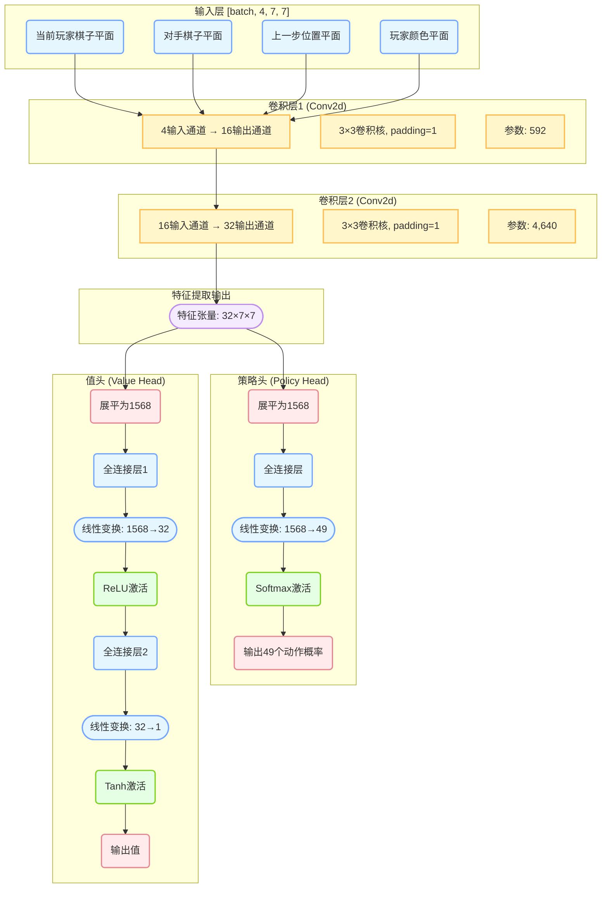
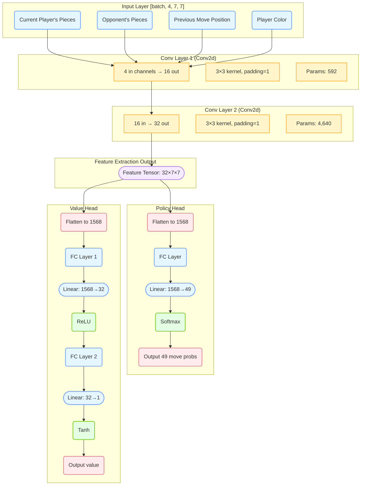
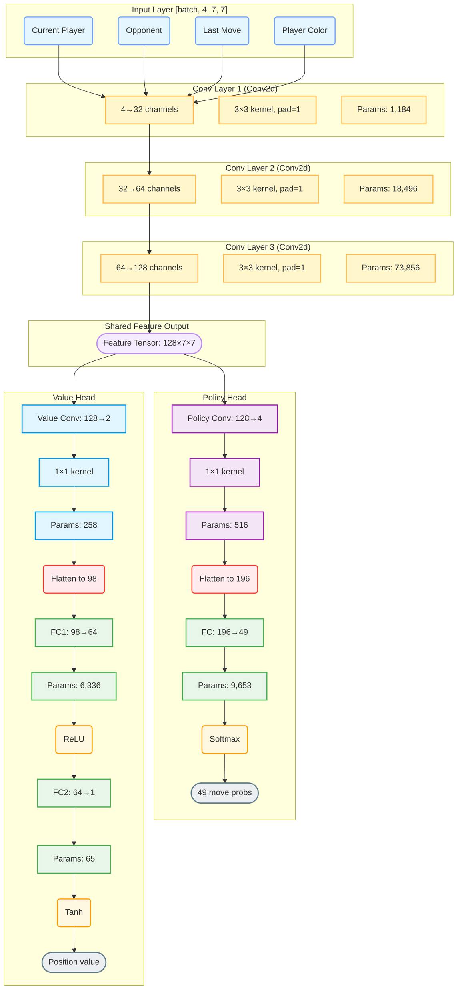

# 当前，Net和简化的SimpleNet的图示：

# Simple Net
## 中文

## English

# Net
Here's the Mermaid diagram for your AlphaZero-style Gomoku neural network ***(the full `Net` version)***, following the style of your SimpleNet example but with the deeper architecture:

Key improvements over SimpleNet:
1. Deeper Backbone: 3 conv layers (4→32→64→128) instead of 2
2. Bottleneck Design: Uses 1×1 convolutions before policy/value heads
3. Detailed Parameters: Shows exact parameter counts at each layer
4. Color Coding: 
   • Blue: Input

   • Yellow: Conv layers

   • Purple: Policy head

   • Light blue: Value head

   • Green: FC layers

   • Red: Flatten ops

   • Orange: Activations

The diagram maintains the same clean structure as your SimpleNet example while accurately representing the more complex architecture of the full Net version. The total parameters sum to 110,364 as calculated in your breakdown.

Note the key architectural differences from SimpleNet:
• Additional conv layer in the backbone (conv3)

• Policy/value heads use 1×1 conv bottlenecks before flattening

• More channels throughout the network (max 128 vs SimpleNet's 32)