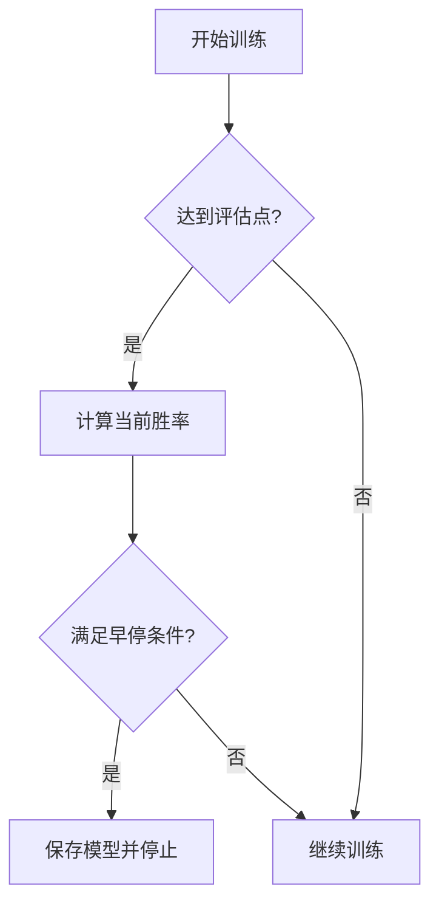

在您当前的五子棋训练代码中，确实没有实现训练早停（Early Stopping）机制。以下是需要添加早停机制的详细方案：

### 一、早停机制实现方案

1. **在`config.py`中添加早停参数**：
```python
class Config:
    def __init__(self):
        # 早停配置
        self.early_stop = True              # 是否启用早停
        self.patience = 20                  # 容忍评估次数不提升
        self.min_delta = 0.01               # 胜率最小提升幅度
        self.min_epochs = 100               # 最小训练批次
```

2. **修改`train.py`的TrainPipeline类**：

```python
class TrainPipeline:
    def __init__(self, config):
        # 添加早停相关变量
        self.best_win_ratio = 0.0
        self.early_stop_counter = 0
        self.should_stop = False

    def run(self):
        for i in range(self.config.game_batch_num):
            if self.should_stop:  # 早停检查
                self.logger.info(f"早停触发于批次 {i+1}")
                break
            
            # ...原有训练逻辑...

            if (i+1) % self.config.check_freq == 0:
                win_ratio = self.policy_evaluate()
                
                # 早停判断逻辑
                if self.config.early_stop and i >= self.config.min_epochs:
                    if win_ratio > self.best_win_ratio + self.config.min_delta:
                        self.best_win_ratio = win_ratio
                        self.early_stop_counter = 0
                    else:
                        self.early_stop_counter += 1
                        if self.early_stop_counter >= self.config.patience:
                            self.should_stop = True
```

### 二、完整早停判断逻辑

```python
def check_early_stopping(self, current_win_ratio, current_epoch):
    """早停条件判断"""
    if current_epoch < self.config.min_epochs:
        return False
    
    if current_win_ratio > self.best_win_ratio + self.config.min_delta:
        self.best_win_ratio = current_win_ratio
        self.early_stop_counter = 0
        return False
    else:
        self.early_stop_counter += 1
        if self.early_stop_counter >= self.config.patience:
            self.logger.info(f"早停条件满足：连续{self.config.patience}次评估未提升")
            return True
    return False
```

### 三、需要监控的关键指标

1. **在TensorBoard中添加监控**：
```python
self.writer.add_scalar('Eval/win_ratio', win_ratio, i)
self.writer.add_scalar('Eval/early_stop_counter', 
                      self.early_stop_counter, i)
```

2. **建议监控指标**：
- 评估胜率（核心指标）
- 训练损失曲线
- KL散度值
- 策略熵值

### 四、早停机制流程图



### 五、参数设置建议

| 参数 | 推荐值 | 说明 |
|------|--------|------|
| patience | 10-20 | 取决于check_freq间隔 |
| min_delta | 0.01-0.02 | 避免微小波动触发 |
| min_epochs | 总批次的10% | 确保基础训练量 |

### 六、验证方法

1. **强制触发测试**：
```python
# 在config.py中设置
self.patience = 2  # 小值方便测试
self.min_delta = 0.5  # 大阈值确保触发
```

2. **日志检查**：
```
[INFO] 早停触发于批次 150
[INFO] 最佳胜率: 0.75, 当前胜率: 0.72
```

需要我为您调整现有代码中的其他部分来配合早停机制吗？例如模型保存逻辑或评估频率的设置。